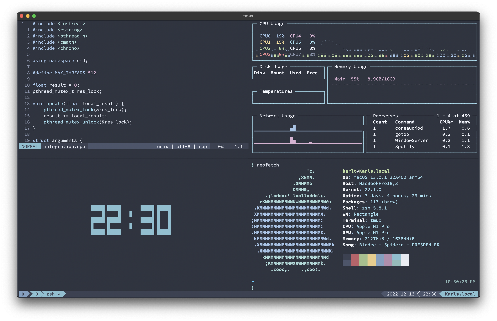

# .dotfiles
My dotfiles

# Install bash and vim config on remote server
**Note:** The installation script `install.py` expects the dotfiles repository to live inside the home directory.

`$ git clone git@github.com:thomssonkarl/.dotfiles.git ~/dotfiles`
`$ chmod +x ~/dotfiles/install.py`
`$ ./install.py`

**From vim command:** `:!PlugInstall`

